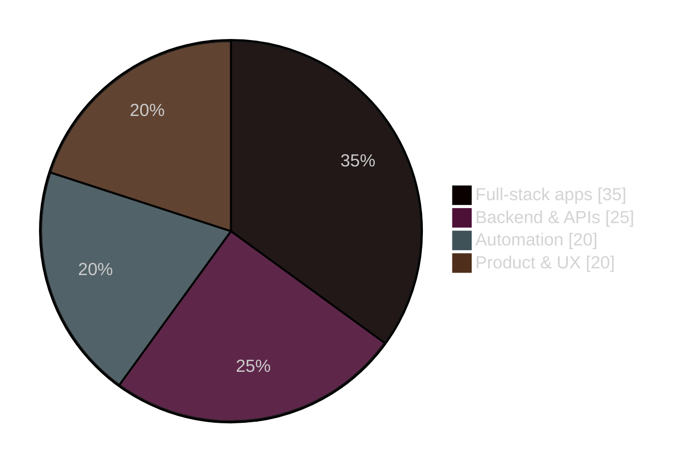
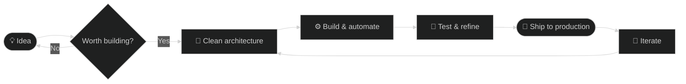

<!-- ╔═══════════════════════════════════════════════════════════════╗ -->
<!--                          HEADER BANNER                            -->
<!-- ╚═══════════════════════════════════════════════════════════════╝ -->


<div align="center">

<a href="https://github.com/louisbdc">
  
</a>

<p>
  
  
  
  
</p>

</div>

<!-- ╔═══════════════════════════════════════════════════════════════╗ -->
<!--                          TECH STACK                               -->
<!-- ╚═══════════════════════════════════════════════════════════════╝ -->

<div align="center">

## 🛠️ Tech Stack


<br />


</div>

<!-- ╔═══════════════════════════════════════════════════════════════╗ -->
<!--                       GITHUB ANALYTICS                            -->
<!-- ╚═══════════════════════════════════════════════════════════════╝ -->

<div align="center">

## 📊 GitHub Analytics


<br />


<br />


<br />


</div>

<!-- ╔═══════════════════════════════════════════════════════════════╗ -->
<!--                        FOCUS & WORKFLOW                           -->
<!-- ╚═══════════════════════════════════════════════════════════════╝ -->

## 🎯 Where my focus goes



## 🚀 How I ship



<!-- ╔═══════════════════════════════════════════════════════════════╗ -->
<!--                       FEATURED PROJECTS                           -->
<!-- ╚═══════════════════════════════════════════════════════════════╝ -->

## 📦 Featured Projects

<table>
  <tr>
    <td width="50%" valign="top">
      <h3>⚡ <a href="https://github.com/louisbdc/SparkHub">SparkHub</a></h3>
      <p>Modern app focused on a smooth, practical UX.</p>
      
      
    </td>
    <td width="50%" valign="top">
      <h3>🛣️ <a href="https://github.com/louisbdc/renov-route">renov-route</a></h3>
      <p>Structured development & practical workflow execution.</p>
      
      
    </td>
  </tr>
  <tr>
    <td width="50%" valign="top">
      <h3>📖 <a href="https://github.com/louisbdc/delphine-biographe">delphine-biographe</a></h3>
      <p>Polished web project built for clarity & maintainability.</p>
      
      
    </td>
    <td width="50%" valign="top">
      <h3>❄️ <a href="https://github.com/louisbdc/wintermate">wintermate</a></h3>
      <p>Product-oriented app, useful and cleanly implemented.</p>
      
      
    </td>
  </tr>
</table>

<!-- ╔═══════════════════════════════════════════════════════════════╗ -->
<!--                      CONTRIBUTION SNAKE                            -->
<!-- ╚═══════════════════════════════════════════════════════════════╝ -->

<div align="center">

## 🐍 Contribution Graph

<picture>
  <source media="(prefers-color-scheme: dark)" srcset="https://raw.githubusercontent.com/louisbdc/louisbdc/output/github-contribution-grid-snake-dark.svg" />
  <source media="(prefers-color-scheme: light)" srcset="https://raw.githubusercontent.com/louisbdc/louisbdc/output/github-contribution-grid-snake.svg" />
  
</picture>

</div>

<!-- ╔═══════════════════════════════════════════════════════════════╗ -->
<!--                       ENGINEERING VALUES                          -->
<!-- ╚═══════════════════════════════════════════════════════════════╝ -->

## 💎 Engineering Values

```diff
+ Clean structure     > clever shortcuts
+ Reliable systems    > fragile prototypes
+ Clear APIs          > hidden complexity
+ Useful products     > unnecessary features
+ Long-term quality   > temporary speed
```

<!-- ╔═══════════════════════════════════════════════════════════════╗ -->
<!--                            CONTACT                                -->
<!-- ╚═══════════════════════════════════════════════════════════════╝ -->

<div align="center">

## 🤝 Let's build something

<a href="mailto:l2caumont@gmail.com">
  
</a>
<a href="https://github.com/louisbdc">
  
</a>

</div>


